# Starburst Detection

# 故事介紹

在2015年，一部名為「刀劍神域」的動畫在全球掀起了一股熱潮，吸引了大量的粉絲。然而，有些網友在論壇上對其優劣進行激烈的爭論。這場爭論引來了大量看熱鬧的網友，他們將刀劍神域中的角色做成梗圖，以此諷刺那些不接受批評的粉絲。這些梗圖被統稱為「星爆圖」，取名自主角的著名招式。由於這些圖片具有一定的幽默感，因此已成為8年級生間的網路文化。

然而，並非所有人都喜歡這些「星爆圖」。有些人可能會希望過濾掉這些內容。在這種情況下，這個模型就可以派上用場了。它可以識別出這些「星爆圖」，並將其過濾掉，以確保使用者只看到他們希望看到的內容。

此外，這個模型還可以用來找出隱藏的「星爆圖」。有時候，這些圖片可能會被巧妙地隱藏在其他內容中(如下圖)，但是這個模型可以識別出它們，並將其框選出來。

# 資料集介紹

- 本專題所使用到的圖片皆為從網路上人工搜集而來，圖源：
    - Dcard-梗圖版
    - 巴哈姆特-場外休憩區
    - Google搜尋
    
    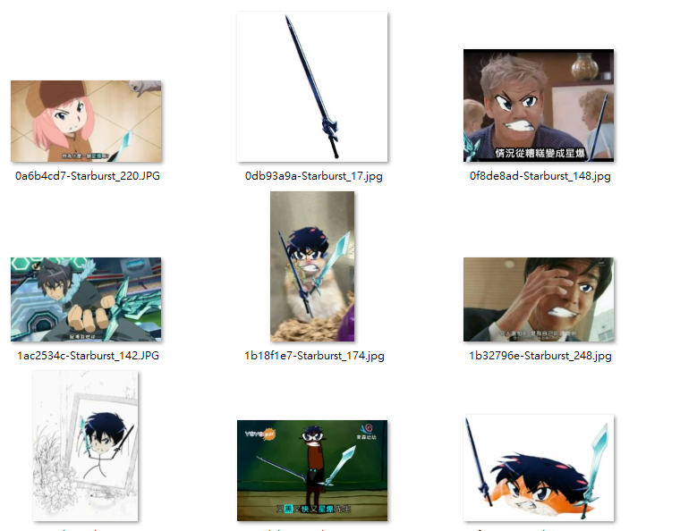
    

### 資料增強：

- RandomBrightness
- RandomContrast
- GaussNoise

### 偵測類別：

- 人物特徵
    - kirito_eye_1
        
        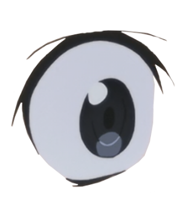
        
    - kirito_mouth_1
        
        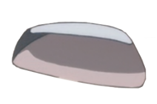
        
    - kirito_eye_2
        
        
        
    - kirito_mouth_2
        
        
        
    - kirito_eye_3
        
        
        
    - kirito_mouth_3
        
        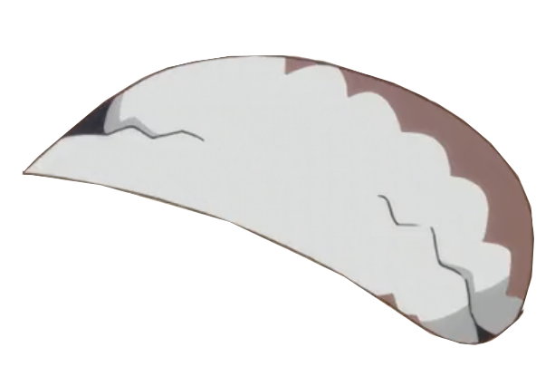
        
    - kirito_hair
        
        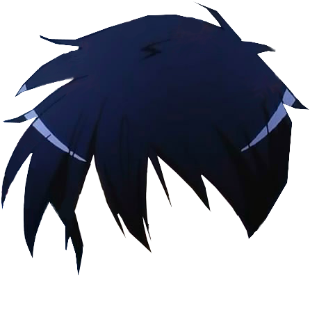
        

- 生物
    - The_Gleameyes
        - 閃耀魔眼
            
            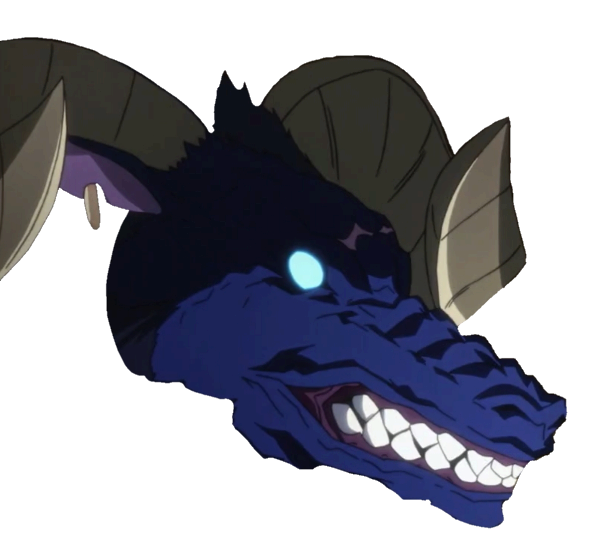
            
    - Ragout_Rabbit
        - 雜燴兔
            
            
            

- 道具類
    - Elucidator
        - 闡釋者
            
            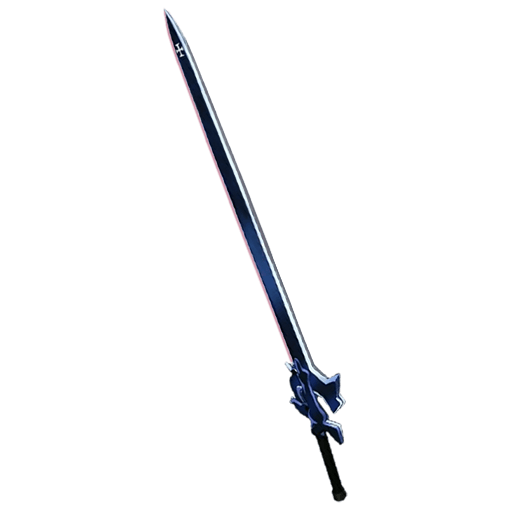
            
    - Dark_Repulsor
        - 逐暗者
            
            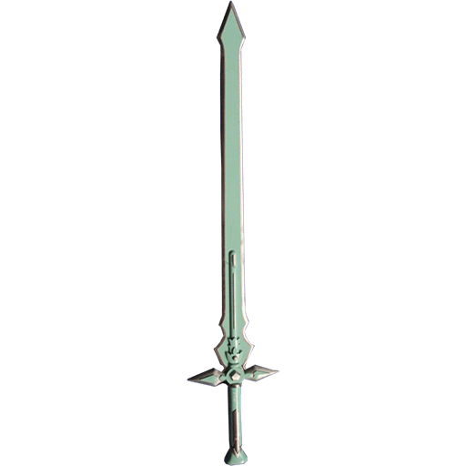
            
    - Liberator
        - 解放者
            
            
            
    - Zanbato_Sword
        - 斬馬刀
            
            
            
    - Nervgear
        
        
        

- 其他
    - torch
        - 火炬
            
            
            
    - Aincrad
        - 艾恩葛朗特
            
            
            
    - Starburst_Stream_pose
        - 星爆氣流斬pose
            
            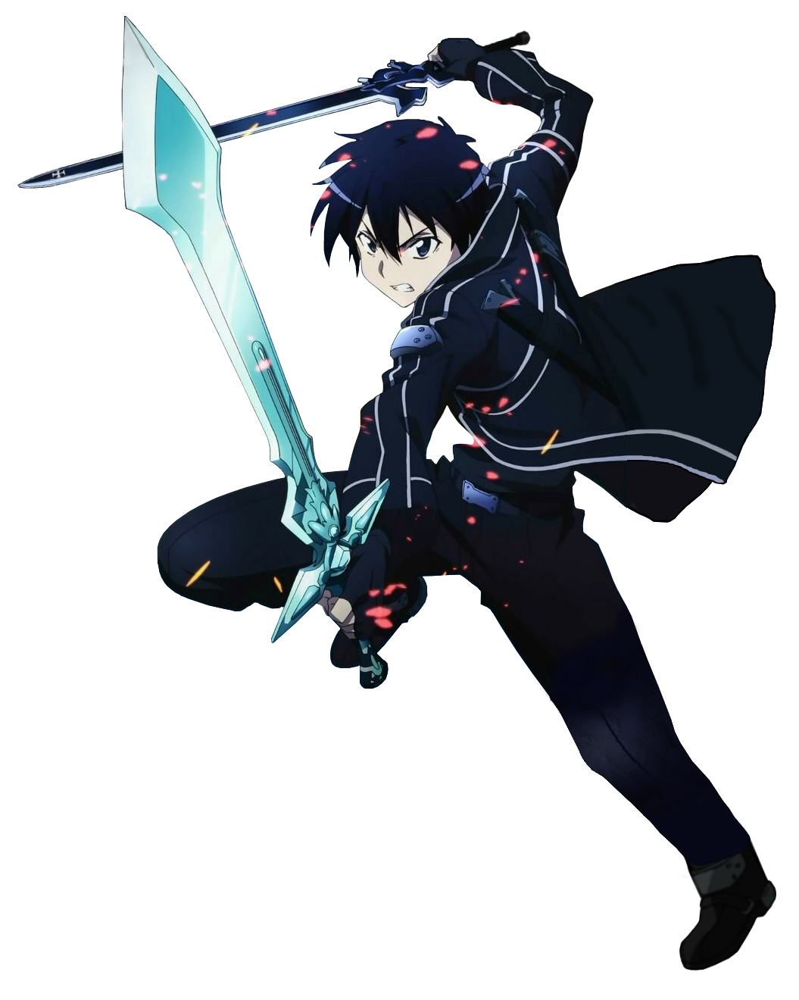
            

# Result

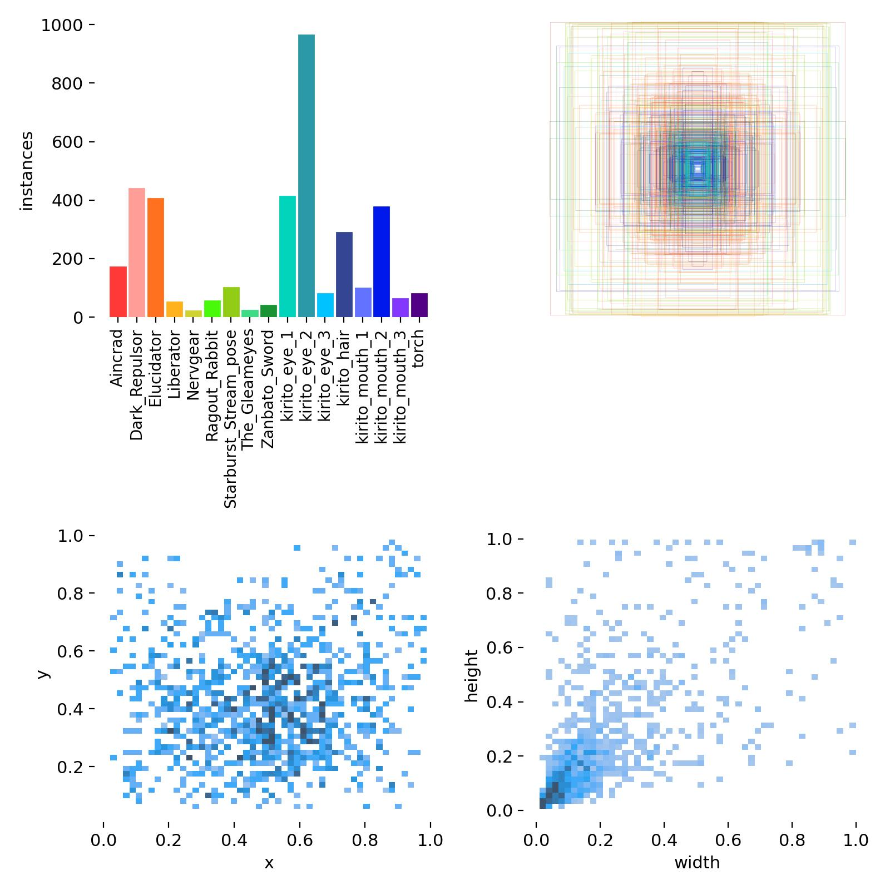

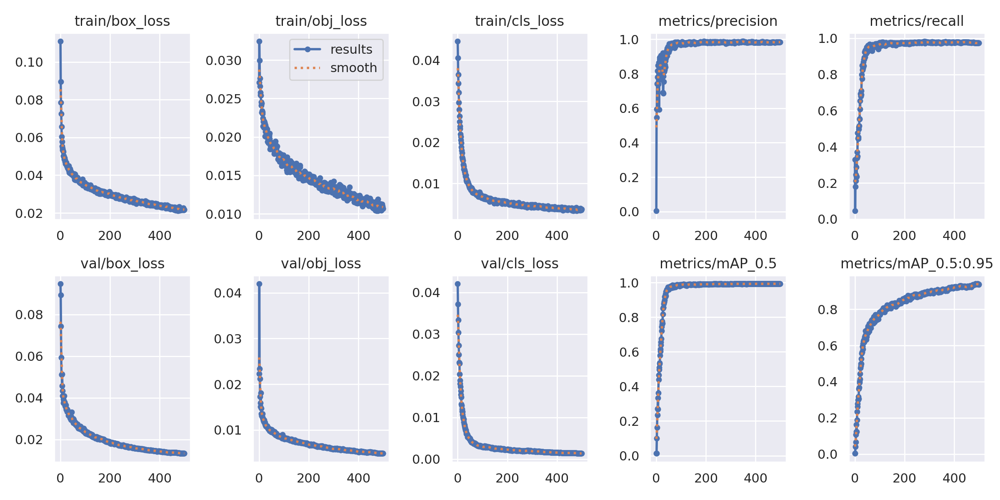

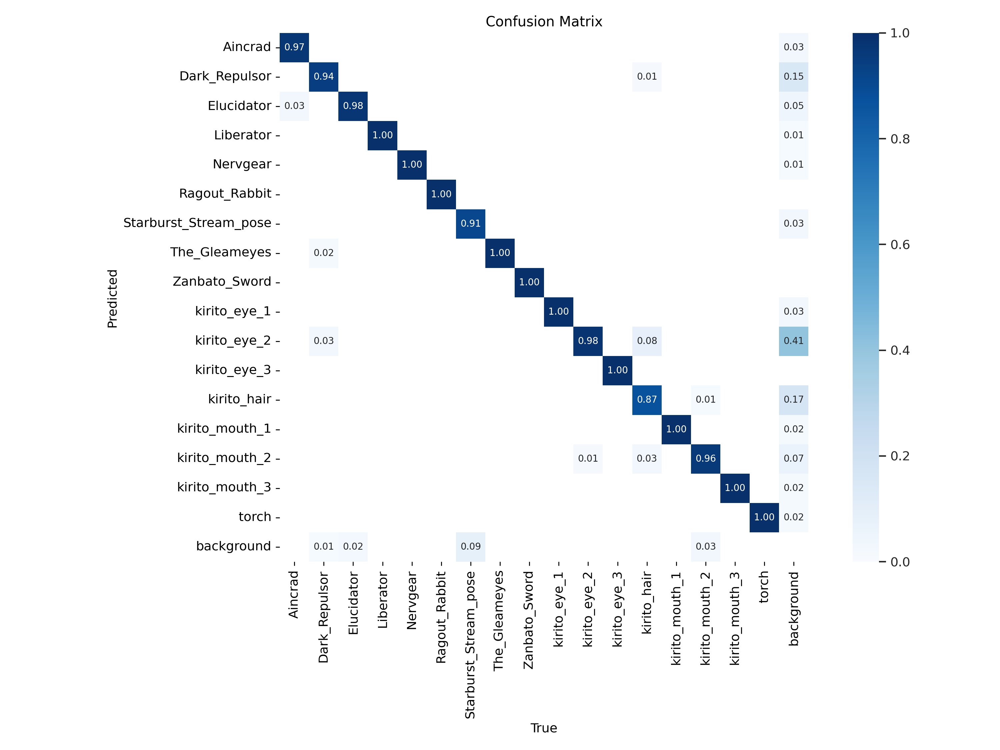

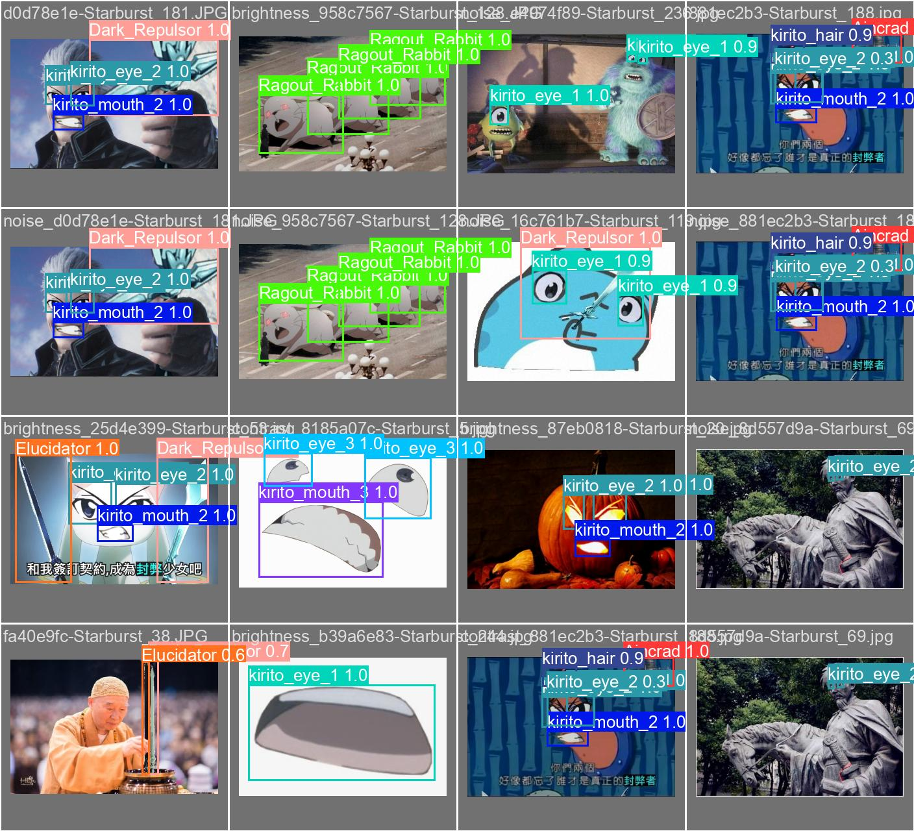

